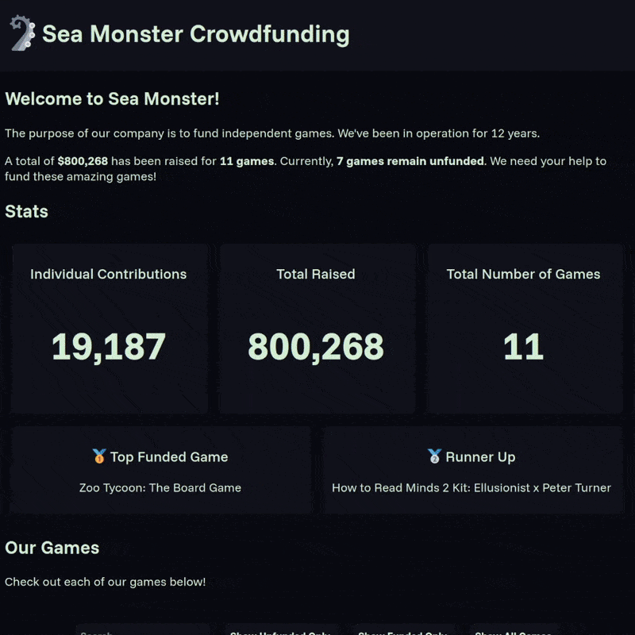

# WEB102 Prework - *Name of App Here*

Submitted by: **Rafael Niebles**

**Sea Monster** is a website for the company Sea Monster Crowdfunding that displays information about the games they have funded.

Time spent: **3** hours spent in total

## Required Features

The following **required** functionality is completed:

* [x] The introduction section explains the background of the company and how many games remain unfunded.
* [x] The Stats section includes information about the total contributions and dollars raised as well as the top two most funded games.
* [x] The Our Games section initially displays all games funded by Sea Monster Crowdfunding
* [x] The Our Games section has three buttons that allow the user to display only unfunded games, only funded games, or all games.

The following **optional** features are implemented:

* [x] The entire webpage's look was modified to be darker and more modern.
* [x] The Our Games section has a search bar beside the filter buttons that allows the user to display games that match the given search term. 
* [x] The Our Games section's game cards have their pledge information color-coded to show whether the game has met its funding goal. Unfunded games are orange, whereas funded games are green.

## Video Walkthrough

Here's a walkthrough of implemented features:

GIF created with [Ezgif](https://ezgif.com/).  

## Notes

The page's CSS was cleaned up as much as possible, but it may not be perfect; there might be some redundancy in some places. 

Given that everything looks as desired and there are no noticeable failures, however, it was left as-is.

## License

    Copyright [2025] [Rafael Niebles]

    Licensed under the Apache License, Version 2.0 (the "License");
    you may not use this file except in compliance with the License.
    You may obtain a copy of the License at

        http://www.apache.org/licenses/LICENSE-2.0

    Unless required by applicable law or agreed to in writing, software
    distributed under the License is distributed on an "AS IS" BASIS,
    WITHOUT WARRANTIES OR CONDITIONS OF ANY KIND, either express or implied.
    See the License for the specific language governing permissions and
    limitations under the License.
